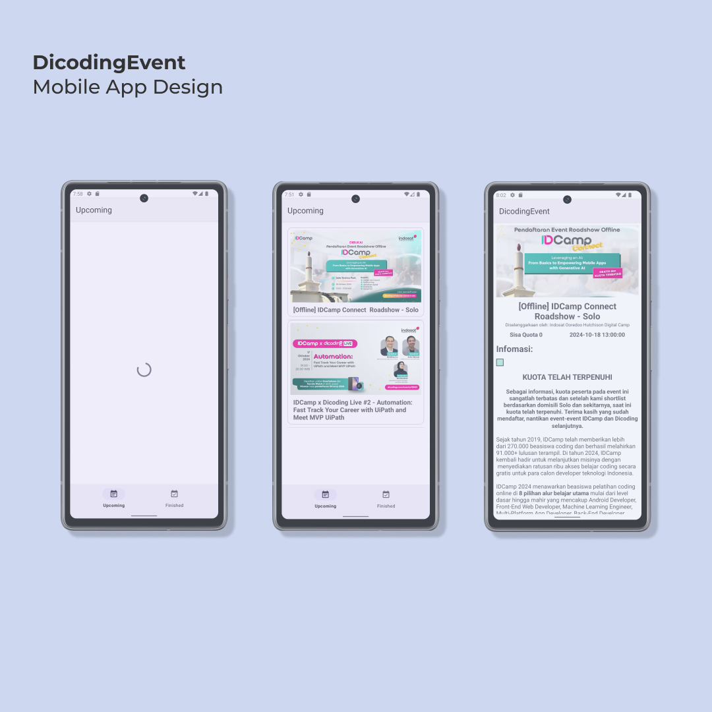
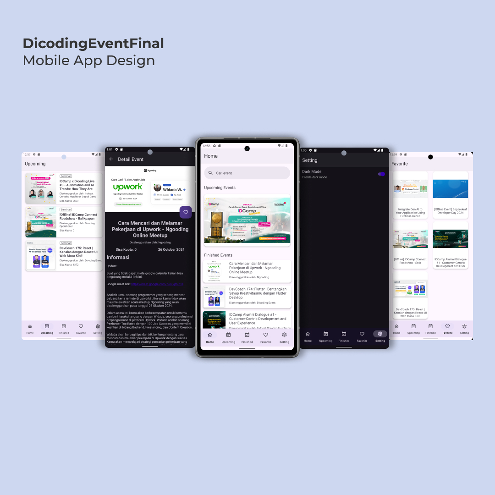

# Dicoding-FundamentalAndroid
Repository for [Documentations Dicoding - Belajar Fundamental Aplikasi Android](https://www.dicoding.com/academies/14)

## Purpose
Record Project Belajar Fundamental Aplikasi Android from [Dicoding Indonesia](https://www.dicoding.com/)

## Screenshots Submission
### DicodingEvent (First Submission)

### DicodingEventFinal (Final Submission)

## Features
### DicodingEvent Submission Checklists
- [x] Display upcoming events page
- [x] Display finished events page
- [x] Display details page
- [x] Display a list of events data from API
- [x] Include a button to open the event link (implicit intent)
- [x] Display loading indicator

### DicodingEventFinal Submission Checklists
- [x] Contains all features from DicodingEvent App (First submission)
- [x] Adding favorite feature using database
- [x] Adding theme setting (support light & dark mode)

## Installation
- Download and install DicodingEvent app [here](https://github.com/e-haikal/Dicoding-FundamentalAndroid/releases/download/v1.0.0/DicodingEvent_1.0.0.apk).
- Download and install DicodingEventFinal app [here](https://github.com/e-haikal/Dicoding-FundamentalAndroid/releases/download/v2.0.0/DicodingEvent_2.0.0.apk).

## Author
- **Asman Haikal**
